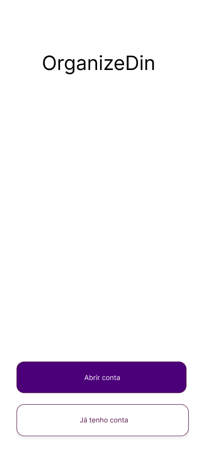
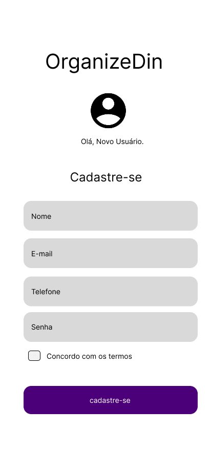
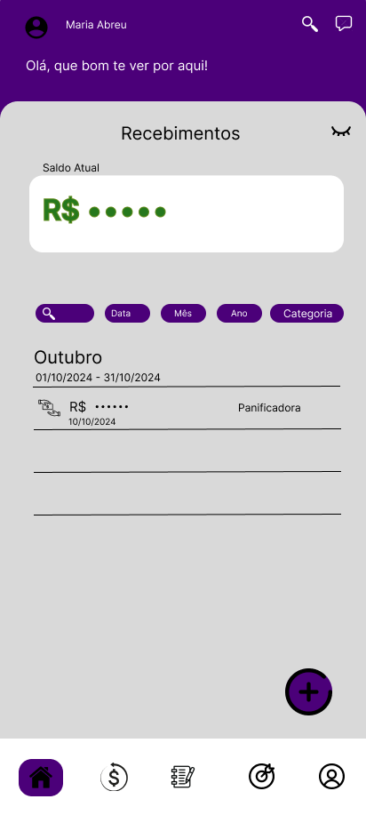
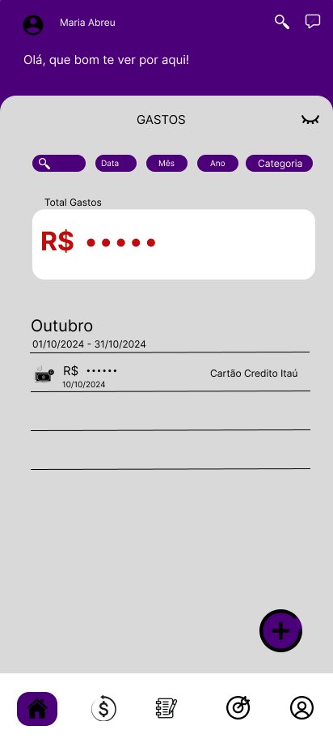
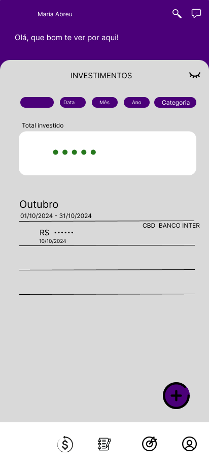
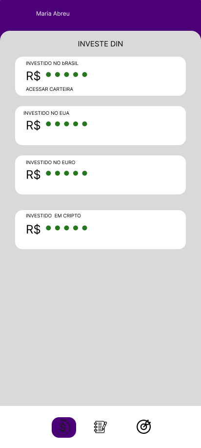
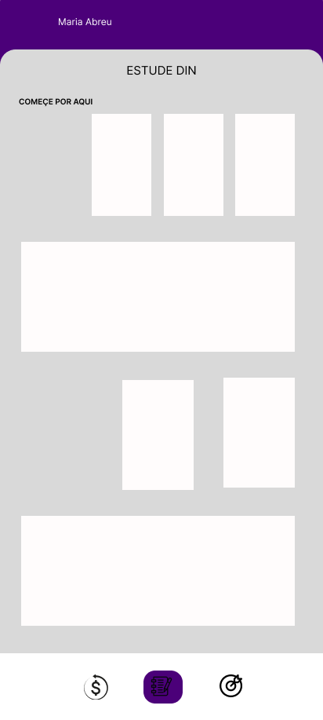
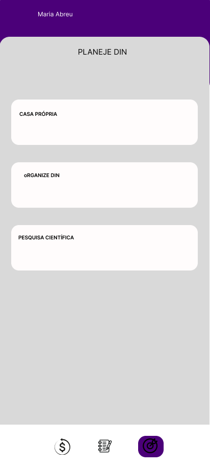
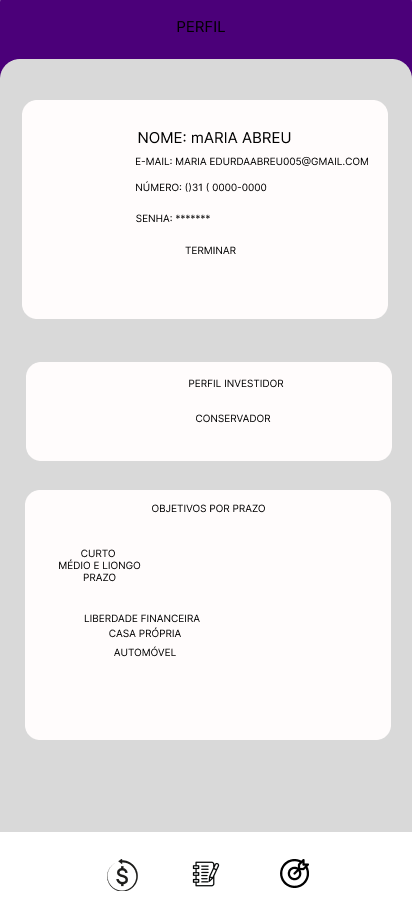

<h3> Fintech OrganizeDin </h3>

<h6> Para pessoas com recursos financeiros a serem gerenciados. 
Que estão insatisfeitos com a administração financeira atual. 
Nosso produto OrganizeDin é uma de proposta de educação 
finaceira completa. 
Que fornece gerenciamento de finanças, planejamento 
financeiro, estudos, notícias e informações necessária de acordo 
com cada perfil de usuário. 
Ao contrário de aplicativos que só fornecem planejamento ou 
gerenciamento ou estudos, sendo disponíveis somente com 
opções de planos pagos. 
Nosso produto é completo e fornece o gerenciamento financeiro, 
planejamento de metas, estudos, notícias e informações de 
acordo com a análise de perfil de cada usuário, além  disso, 
possue opções de planos gratuitos. </h6>

<h3> Protótipo Das Telas OrganizeDin </h3>

  
  
  
  
  
  
  
  
  
  

<h3> Tecnologias Usadas no Projeto </h3>
  <ul>
    <li>Figma</li>
    <li>trellor</li>
    <li>Java</li>
    <li>Boot Strap</li>
    <li>Html</li>
    <li>Css</li>
    <li>Javascript</li>
  </ul>
